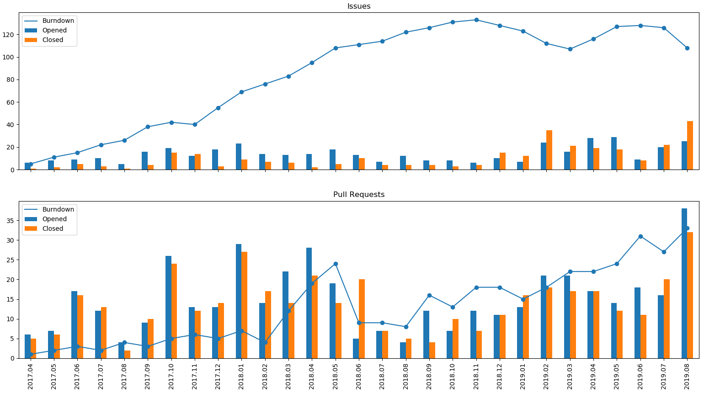
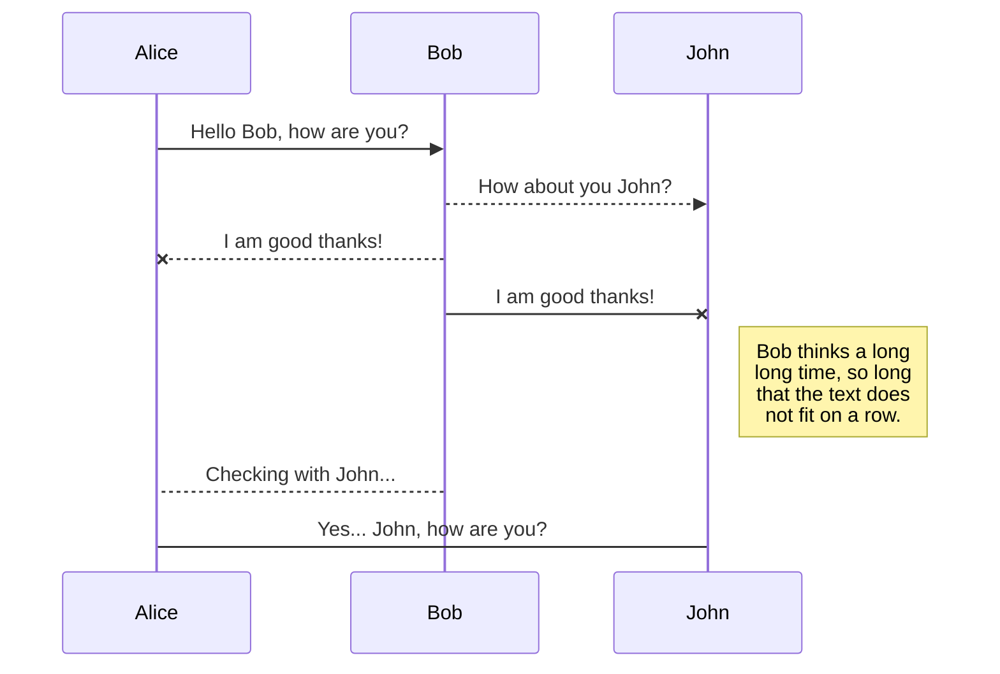
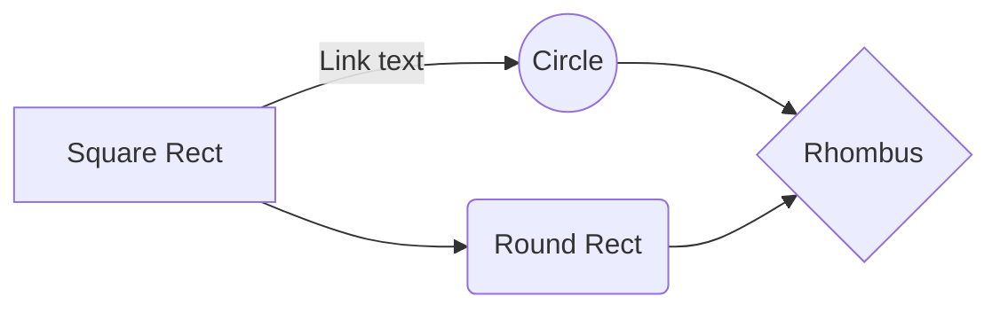

I decided to write a Python script to extract the interesting analytics from GitHub.

One of the main charts to quickly check the state of your GitHub project, is a burndown chart of issues and pull requests. The example chart below shows a number of opened and closed issues by month. With bars one can easily check if the number of closed issues exceeds the number of open issues, and the overall burndown for this. And another image shows the same for pull requests. For example, from the below figure we can see, that the number of open issues stays almost on the same level, so probably more effort is required to review those issues. The chart of pull requests shows the increasing number of unclosed PRs, so it is better to pay attention to this arising number.


Similar chart can be drawn on a weekly basis.
A cool way to understand a breakdown of the issues for you project is to use labels. Our project has several levels: core library, sample applications and examples, CMake build system, and documentation. So an issue may address one of those, or be a general or usage example question. When you labels each issue, the following pie chart can be drawn.


## The Goal


### Choosing a Set of Tools

The first step is to find out a way to fetch data related to issues from a GitHub project.
GitHub's [REST API](https://developer.github.com/v3/) perfectly fits the task.

The next step is to decide the best way to work with the API in Python.
We can work with the API directly using the `requests` Python library. This is a good path to go in case you want to get some experience with the REST API and understand how it works.
Obviously, some time has to be spent to create a good set of functions to form a request, receive a response and extract the data we need for the project. GitHub does not allow to load all the issues at once. Instead it suggest to use a concept of [pagination](https://developer.github.com/v3/#pagination):

> Requests that return multiple items will be paginated to 30 items by default. You can specify further pages with the ?page parameter. > For some resources, you can also set a custom page size up to 100 with the ?per_page parameter. 

Therefore, issues have to be enumerated, and fetched.
Is the wheel already invented or it has to be designed from scratch?


It turned out there is the [PyGitHub](https://github.com/PyGithub/PyGithub) project that already covers communication with GitHub via REST API, so we can use it. Let's check if we can easily retrieve and parse the data from GitHub.


```python
import pandas as pd
from github import Github

def load(reponame, login, password):
    # Log in to GitHub (see below)
    gh = Github(login, password)
    # Define the repository: reponame="user/repo"
    repo = gh.get_repo(reponame)

    # Create a pandas dataframe
    column_names = ["Created", "State", "ClosureTime", "IsPR", "Labels", "Milestone"]
    df_issues = pd.DataFrame(columns = column_names)

    issues = repo.get_issues(state="all")

    for issue in issues:
        df_issues.loc[issue.number] = [issue.created_at, issue.state, issue.closed_at if issue.state == "closed" else pd.NaT,
                    issue.pull_request != None, issue.labels, issue.milestone]
    
    df_issues.to_pickle(f"./{repofile}.pkl")
    return df_issues
```

The code sample has revealed one more item in a TODO list in case we would use `requests` library directly: authorization.
GitHub REST API has a [rate limiting](https://developer.github.com/v3/#rate-limiting) for requests. Requests from unauthorized users are limited to 60 per hour, while there can be up to 5000 authorized requests.

> For API requests using Basic Authentication or OAuth, you can make up to 5000 requests per hour. 
> For unauthenticated requests, the rate limit allows for up to 60 requests per hour.

Luckily the `PyGitHub` already solves that for us. Now we can easily retrieve information about issues in a repository. Let's go on.

### Store the Data

Fetching data takes time to send requests to GitHub and process responses. We can have a local cache of fetched issues and update it only when we want to. Let's modify the `load_data` function a bit to store fetched data to a pickle, and read a peakle if fetching is not requested.

```python
def load_data(fetch):
	repofile = reponame.replace("/", "_")
	if fetch == False:
		df_issues = pd.read_pickle(f"./{repofile}.pkl")
		return df_issues

	#reponame = input("GitHub repo")
	login    = input("Enter GitHub username: ")
	password = getpass("GitHub password:")

	gh = Github(login, password, per_page=100)
	repo = gh.get_repo(reponame)

	column_names = ["Created", "State", "ClosureTime", "IsPR", "Labels", "Milestone"]
	df_issues = pd.DataFrame(columns = column_names)

	issues = repo.get_issues(state="all")
	print(f"Fetching {issues.totalCount} issues")

	for issue in tqdm(issues, total=issues.totalCount):
		df_issues.loc[issue.number] = [issue.created_at, issue.state, issue.closed_at if issue.state == "closed" else pd.NaT,
					issue.pull_request != None, issue.labels, issue.milestone]

	#b = repo.get_pulls(state="all")
	#print(f"Pulls: {b.totalCount}")

	df_issues.to_pickle(f"./{repofile}.pkl")
	return df_issues
```

Now we can load data once and store it locally. This will save us some time and help focus on data processing.
Further improvement of this function would be to fetch only those issues, that have changed since the last fetch. GitHub's REST API provides this functionality.

### Plotting a Burndown Chart

Now that we know how to load information about issues, we need to collect the data and plot it. We already have a function to fetch issues from GitHub repository. We need to represent it as a dataframe and plot a chart.

We will use Pandas and mathplotlib for that purpose.

We need some processing function to convert our issues to an appropriate representation.
What we need are three counters for issues and for PRs:
* Number of items opened this month
* Number of items closed this month
* A burndown counter: number of items remaining open this month

The following function processes a data frame of issues, and returns two data frames: `pulls_stats` an `issues_stats`.
The resulting data frames have the above counters for each month.

```python
def process_df(df):
	# Find out the starting year and current year
	year_start = int(df.iloc[-1].Created.date().strftime("%Y"))
	year_now   = int(date.today().strftime('%Y'))
    # Create string typed index: 'YYYY.MM'
	dateindex  = [str(y) + "."+ f"{x:0>2}" for y in range(year_start,year_now) for x in range(1, 13)]
	dateindex += [str(year_now) + "."+ f"{month:0>2}" for month in range(1, int(date.today().strftime('%m')) + 1)]

    # Create data frames for statistics on issues and PRs
	pulls_stats  = pd.DataFrame(0, columns = ["Opened", "Closed", "Burndown"], index=dateindex)
	issues_stats = pd.DataFrame(0, columns = ["Opened", "Closed", "Burndown"], index=dateindex)

	# Looping through issues in the dataframe
	for number, item in df.iterrows():
        # stats is a reference to a dataframe (not a copy)
		stats = pulls_stats if item.IsPR else issues_stats
		# A pattern to covert date to 'YYYY.MM'
		pattern = "%Y.%m"
		key = str(item.Created.strftime(pattern))
        # Increment opened counter for current month
		stats.loc[key].Opened += 1
        # Increment burndown counter for current and following months
		key_index = stats.index >= key
		stats.loc[key_index, "Burndown"] += 1

        # Process closed item
		if item.State == "closed":
			closure_key = str(item.ClosureTime.strftime(pattern))
			key_index = stats.index >= closure_key
			stats.loc[key_index, "Burndown"] -= 1
			stats.loc[closure_key].Closed   += 1

	return issues_stats, pulls_stats
```

```python
def burndown_chart(issues_stats, pulls_stats):
	f, (ax1, ax2) = plt.subplots(2, 1, sharex=True)

	issues_stats[['Burndown']].plot(kind="line", linestyle='-', marker='o', ax=ax1)
	issues_stats[['Opened', 'Closed']].plot(kind="bar", ax=ax1)
	ax1.set_title('Issues')

	pulls_stats[['Burndown']].plot(kind="line", linestyle='-', marker='o', ax=ax2)
	pulls_stats[['Opened', 'Closed']].plot(kind="bar", ax=ax2)
	ax2.set_title('Pull Requests')
	plt.show()
```

Now we can have a look on our beautiful chart!




### Measuring Performance

Let's measure how much time we spend in our functions `load_df` and `process_df`. To to this we will use python decorators.

```python
import time
from functools import wraps

def timeperf(f):
	@wraps(f)
	def wrapper(*args, **kwargs):
		start = time.time()
		result = f(*args, **kwargs)
		end = time.time()
		print(f"Elapsed time for {f.__name__}: {end - start}")
		return result
	return wrapper
```

To measure the time spent in function we can just add a decorator like this:
```python
@timeperf
def load_df(fetch):
    #...
```

### Improving Data Processing

One of the things to remember when you work with Pandas library is that is is optimized to work with a data frame as a whole. The library is highly optimized to select, filter and modify data in a data frame using functions of the data frame.
A mistake we did in data processing is in the loop `for number, item in df.iterrows():`. Looping though a data frame row by row is very expensive, because each time we access only one element in the whole matrix.

What we need is to count the number of items (issues or PRs) opened this month and closed this month.
We can do this in a better way:

```python
def process_df_new(data):
	start = data.iloc[-1].Created.date().replace(day=1)
	stop  = date.today().replace(day=1) + relativedelta(months=1)
	index = pd.date_range(start=start, end=stop, freq='M', normalize=True, closed='left')
	pulls_stats  = pd.DataFrame(0, columns = ["Opened", "Closed", "Burndown"], index=index.strftime('%Y.%m')).fillna(0)
	issues_stats = pd.DataFrame(0, columns = ["Opened", "Closed", "Burndown"], index=index.strftime('%Y.%m')).fillna(0)
	index += timedelta(hours=24)

	pattern = "%Y.%m"
	prev_date = start
	for i in index:
		key = str(prev_date.strftime(pattern))
		sel_created = data[(data.Created >= pd.to_datetime(prev_date)) & (data.Created < pd.to_datetime(i))]
		pulls_stats.loc[key].Opened  += len(sel_created[sel_created.IsPR == True])
		issues_stats.loc[key].Opened += len(sel_created[sel_created.IsPR == False])

		sel_closed = data[(data.ClosureTime >= pd.to_datetime(prev_date)) & (data.ClosureTime < pd.to_datetime(i))]
		pulls_stats .loc[key].Closed += len(sel_closed[sel_closed.IsPR == True])
		issues_stats.loc[key].Closed += len(sel_closed[sel_closed.IsPR == False])

		future_rows = pulls_stats.index >= key
		pulls_stats.loc[future_rows, "Burndown"] += pulls_stats.loc[key].Opened - pulls_stats.loc[key].Closed
		future_rows = issues_stats.index >= key
		issues_stats.loc[future_rows, "Burndown"] += issues_stats.loc[key].Opened - issues_stats.loc[key].Closed

		prev_date = i

	# Find the first date with non-zero data
	idx = (issues_stats.Opened > 0) | (issues_stats.Closed > 0)
	first_date_issues = issues_stats[idx].index[0]
	idx = (pulls_stats.Opened > 0) | (pulls_stats.Closed > 0)
	first_date_pulls = pulls_stats[idx].index[0]
	first_date = min(first_date_issues, first_date_pulls)
	return issues_stats[issues_stats.index >= first_date], pulls_stats[pulls_stats.index >= first_date]
```

The results show performance is improved 300 times.

### PyGitHub Issue

The very first performance issue that I had faced was while detect if an issue is an issue or a pull request.
The code snippet to fetch all issues from GitHub was the following:

```python
from github import Github

gh = Github(login, password, per_page=100)
repo = gh.get_repo(reponame)

column_names = ["Created", "State", "ClosureTime", "IsPR", "Labels", "Milestone"]
df_issues = pd.DataFrame(columns = column_names)
issues = repo.get_issues(state="all")

for issue in issues:
    df_issues.loc[issue.number] = [issue.created_at, issue.state, issue.closed_at if issue.state == "closed" else pd.NaT,
                issue.pull_request != None, issue.labels, issue.milestone]
```

It turned out, that 

### 

```python
def process_db(df, weekly = False, milestone=""):
	if weekly:
		dateindex = [str(y) + "-"+ f"{weeks:0>2}" for y in range(2017,2019) for weeks in range(1, 55)] + ["2019-"+ f"{weeks:0>2}" for weeks in range(1, date.today().isocalendar()[1] + 1)]
	else:
		dateindex = [str(y) + "."+ f"{x:0>2}" for y in range(2015,2019) for x in range(1, 13)] + ["2019."+ f"{month:0>2}" for month in range(1, int(date.today().strftime('%m')) + 1)]

	pulls_stats  = pd.DataFrame(0, columns = ["Opened", "Closed", "Burndown"], index=dateindex)
	issues_stats = pd.DataFrame(0, columns = ["Opened", "Closed", "Burndown"], index=dateindex)

	pattern = "%Y-%V" if weekly else "%Y.%m"
	for number, row in df.iterrows():
		if milestone and (row.Milestone == None or row.Milestone.title != milestone):
			continue

		key = str(row.Created.strftime(pattern))

		key_index = pulls_stats.index >= key

		if (row.IsPR):
			pulls_stats.loc[key_index, "Burndown"] += 1
			pulls_stats.loc[key].Opened += 1
		else:
			issues_stats.loc[key_index, "Burndown"] += 1
			issues_stats.loc[key].Opened += 1

		if row.State == "closed":
			closure_key = str(row.ClosureTime.strftime(pattern))
			key_index = pulls_stats.index >= closure_key
			if (row.IsPR):
				pulls_stats.loc[key_index, "Burndown"] -= 1
				pulls_stats.loc[closure_key].Closed   += 1
			else:
				issues_stats.loc[key_index, "Burndown"] -= 1
				issues_stats.loc[closure_key].Closed   += 1

	# Find the first date with non-zero data
	idx = (issues_stats.Opened > 0) | (issues_stats.Closed > 0)
	first_date_issues = issues_stats[idx].index[0]
	idx = (pulls_stats.Opened > 0) | (pulls_stats.Closed > 0)
	first_date_pulls = pulls_stats[idx].index[0]
	first_date = min(first_date_issues, first_date_pulls)
	return issues_stats[issues_stats.index >= first_date], pulls_stats[pulls_stats.index >= first_date]
```


## UML diagrams

You can render UML diagrams using [Mermaid](https://mermaidjs.github.io/). For example, this will produce a sequence diagram:



And this will produce a flow chart:

