## Introduction

Modern mobile networks are used in a wide variety of ways, including contribution of live events from a mobile device, where the contributor can be stationary or moving. In this article we will examine the characteristics of a 4G network (and SRT behavior) with a stationary contribution source (TPLink M7000 Mobile WLAN Router) located in Northern Asia. The target ingest point is in Western Europe (Microsoft Azure cloud service). The maximum throughput declared by the Internet Service Provider (ISP) is 20 Mbps.

In Section 1 we start by investigating the characteristics of streaming over pure UDP as a transport. In the following Section 2 we estimate two main parameters of the network path: round-trip time (RTT) and network throughput. Those estimates are needed to properly set up and configure the SRT streaming. Finally, we transmit SRT streams and analyze how SRT copes with the 4G network conditions.

## 1. Checking the UDP Streaming

We begin by sending a 5 Mbps constant bitrate (CBR) stream over UDP for two minutes to see the amount of packet loss and jitter on the path. We will use the [srt-xtransmit](https://github.com/maxsharabayko/srt-xtransmit) testing application and the [srt-stats-plotting](https://github.com/mbakholdina/srt-stats-plotting) utility. The commands to run the experiment are presented below. The sending side generates payload at the target bitrate, producing a CBR stream. The payload is then sent over UDP (4G stationary connection) to a remote receiver located in Azure EU West. The `--enable-metrics` argument instructs the payload generator to embed certain markers in the payload that the receiver can use to calculate metrics like packet loss, packet reordering, transmission delay and jitter. See the [srt-xtransmit docs](https://github.com/maxsharabayko/srt-xtransmit/wiki/UseCases) for further information on the topic.

```shell
(receiver, Azure EU West)
./srt-xtransmit receive "udp://:4200" --enable-metrics --metricsfile udp-metrics.csv --metricsfreq 1s

(sender, MacBook Asia North via 4G)
./srt-xtransmit generate "udp://remote_ip:4200" --sendrate 5Mbps --duration 120s --enable-metrics
```

The collected metrics are presented below. Fig. 1 shows the total number of packets received, lost and received out of order. As can be seen, there is quite a persistent loss of 1-2 packets per second. Temporal congestion situations are revealed by a larger loss (10 packets or more). It is worth mentioning that even losing one or two packets per second will likely result in visual artefacts when decoding a video stream. Therefore, some loss recovery mechanisms are needed for a better quality of viewing experience.

Certain changes of the end-to-end delay can be seen on Fig. 2. Still, the end-to-end latency over pure UDP is more or less stable, with a fluctuation region of about 150 ms, and occasional spikes of an extra 400 ms. Note that the end-to-end latency in this case is measured as the difference between system clocks of the two peers. The absolute value must be treated with care, as it heavily depends on how well both clocks are  synchronized (they can't be synchronized 100% accurate due to the laws of physics). However, the change of values over time provides a good estimate of the changes in the end-to-end latency between the sending and the receiving applications.


<figure>
  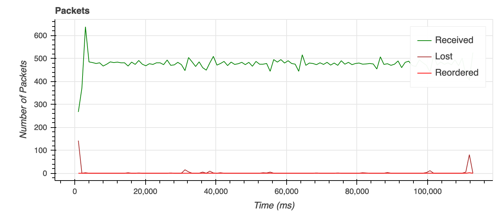
  <figcaption>Fig.1. Packets received over UDP during the 5 Mbps streaming.</figcaption>
</figure>

<figure>
  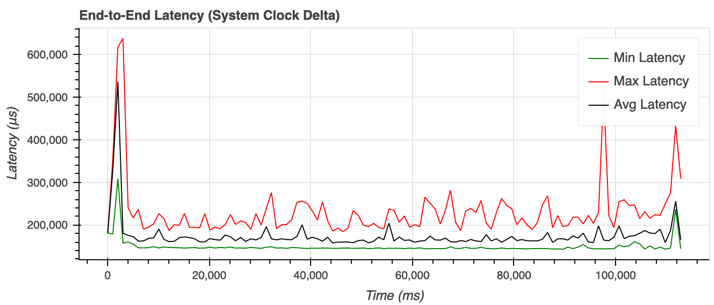
  <figcaption>Fig.2. The end-to-end latency during the 5 Mbps UDP streaming.</figcaption>
</figure>

The jitter of the incoming UDP packets is also quite stable (see Fig. 3) and stays around 4 ms, sometimes reaching 8 ms, which does not seem to be too drastic. In general, a decoder would compensate by having a buffer of the corresponding timespan.

<figure>
  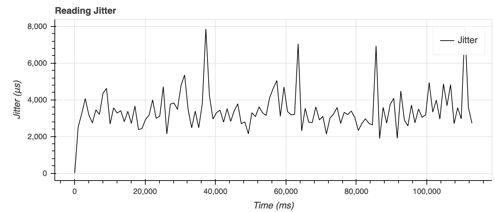
  <figcaption>Fig.3. Receiving jitter during the 5 Mbps UDP streaming.</figcaption>
</figure>

## 2. Configuring SRT Streaming

SRT operates on top of UDP and applies packet recovery and latency management techniques. By default, the main packet loss recovery technique used is Automatic Repeat Query (ARQ), which involves retransmission of lost packets. In the default live streaming configuration SRT also tries to preserve a constant end-to-end delay between the peers. The delay value is configurable. Within the configured SRT receiver buffering delay both sender and receiver may decide to cease retransmitting a lost packet if it is already too late to recover from that packet loss. The packet is then simply "dropped" (in the terminology of SRT) in favor of further packets. For more information please refer to Sections 4.4 - 4.5 of the [SRT Protocol Internet Draft](https://datatracker.ietf.org/doc/html/draft-sharabayko-srt-01#section-4.4).

One of the main configuration parameters used to control retransmissions in SRT is the latency (see [SRTO_LATENCY](https://github.com/Haivision/srt/blob/master/docs/API/API-socket-options.md#SRTO_LATENCY)). The recommended lowest SRT latency value is 3 to 4 times the average Round-Trip Time (RTT). Roughly speaking and assuming RTT remains constant, it takes 1/2×RTT for a packet to reach the receiver. In the case of packet loss, another 1/2×RTT is needed to report a packet loss back to the sender, and one more 1/2×RTT to retransmit the lost packet. Network congestion causes RTT to increase, while SRT has to keep the end-to-end latency constant. Hence having an additional margin in the latency value for packet retransmission is always beneficial.

SRT provides a number of different [real-time statistics](https://github.com/Haivision/srt/blob/master/docs/API/statistics.md). A probing utility can be built on top of SRT to automatically determine network conditions and set recommended SRT configuration parameters such as latency, maximum bandwidth limit, buffer sizes, etc. (see the [SRT Configuration Guidelines](https://github.com/Haivision/srt/blob/master/docs/API/configuration-guidelines.md)). This functionality is, however, outside of the scope of the protocol itself.

**Note:** In the experiments described below we use the [srt-xtransmit](https://github.com/maxsharabayko/srt-xtransmit) testing application built with SRT v1.5.0 RC0. The v1.5.0 release introduces improvements in latency management and Live Congestion Control techniques. Thus, results using previous versions of SRT may differ.

### 2.1. Setting Up Latency

The buffering latency is negotiated and initialised when an SRT connection is first established. From that point on SRT tries to preserve the end-to-end latency, and to compensate for variations of RTT. For more information please refer to the [SRT Latency page](https://srtlab.github.io/srt-cookbook/protocol/tsbpd/latency/) of the SRT Cookbook.

To properly configure SRT latency the RTT of the link needs to be estimated. This can be done using the `ping` command, if available. An alternative approach using SRT metrics is described below.

We run an example 3-minute 5 Mbps SRT streaming to see RTT variations in action using SRT statistics recorded by `srt-xtransmit`. The default SRT latency value is 120 ms (see [SRTO_LATENCY](https://github.com/Haivision/srt/blob/master/docs/API/API-socket-options.md#SRTO_LATENCY)). We only need to collect RTT statistics, and don't need to efficiently recover from possible packet loss. Therefore any latency value would work, and so we just use the default one.

```shell
(receiver, Azure EU West)
./srt-xtransmit receive srt://:4200 --enable-metrics --statsfile stats-rcv.csv --statsfreq 100ms --metricsfile metrics.csv --metricsfreq 1s -v

(sender, MacBook Asia North via 4G)
./srt-xtransmit generate srt://remote_ip:4200 --sendrate 5Mbps --duration 180s --enable-metrics --statsfile stats-snd.csv --statsfreq 100ms -v
```

From the results in Fig. 4, the average RTT of the link is around 150 ms. We were also lucky to record spikes of up to 300 ms during short network congestion periods. Taking the average value of ~150 ms, the recommended lowest SRT latency value of 3 to 4 × RTT will not reliably cover possible delay fluctuations in mobile networks. It is better to use a higher value. For the following experiments a 5×RTT value of 750 ms (5×150 ms) and 8×RTT value of 1200 ms are chosen as SRT latency (buffering delay) for comparison.

<figure>
  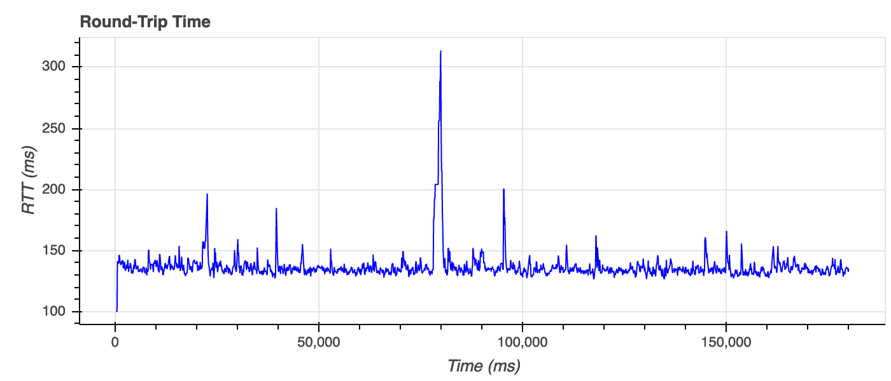
  <figcaption>Fig.4. RTT from the 5 Mbps SRT stream statistics.</figcaption>
</figure>


### 2.2. Limiting Maximum Bandwidth Usage

Normally (when there is no congestion) in the live streaming configuration SRT sends out as much as it gets on the input, meaning the sending bitrate would match with the source (feeding) bitrate. A retransmission of lost packets happens inline on top of that sending bitrate, resulting in a retransmission overhead. When the maximum link throughput is roughly known, it can be provided to SRT, so that the output bitrate stays within this limit, and thereby avoids causing unwanted self-congestion. This limiting maximum bandwidth usage by SRT can be done using the  [SRTO_MAXBW](https://github.com/Haivision/srt/blob/master/docs/API/API-socket-options.md#srto_maxbw) (or related) socket option. Please refer to the "[Configuring Maximum Bandwidth](https://datatracker.ietf.org/doc/html/draft-sharabayko-srt-01#section-5.1.1)" section of the [SRT Internet Draft](https://datatracker.ietf.org/doc/html/draft-sharabayko-srt-01).

In our testing environment the maximum throughput defined by the ISP is around 20 Mbps. This does not mean that a 20 Mbps stream is able to cross the network steadily. However, if the sending rate occasionally reaches 20 Mbps, most of the packets might reach the receiver. There are many utilities for bandwidth probing  ([iperf](https://iperf.fr/), [ethr](https://github.com/microsoft/ethr), etc.). Here we will present an alternative approach of measuring the throughput using SRT.

To better identify the actual boundaries, let us start sending a 5 Mbps live stream using SRT, increasing the source bitrate by 2.5 Mbps every 15 seconds. Graphs below show [SRT stats](https://github.com/Haivision/srt/blob/master/docs/API/statistics.md) from the SRT sender and receiver. It can be clearly seen that the 5 Mbps live stream does not encounter any notable congestion (see interval 0 - 15 seconds on Fig. 5-6). Higher streaming rates of 7.5 Mbps and 10 Mbps in general pass through the network, but are relatively often impacted by some notable packet drops and increases in RTT (a side indicator of congestion in the network, Fig. 7). Sending at 12.5 Mbps (seconds 45 - 60 on Fig. 5-6) causes notable congestion on the path.

<figure>
  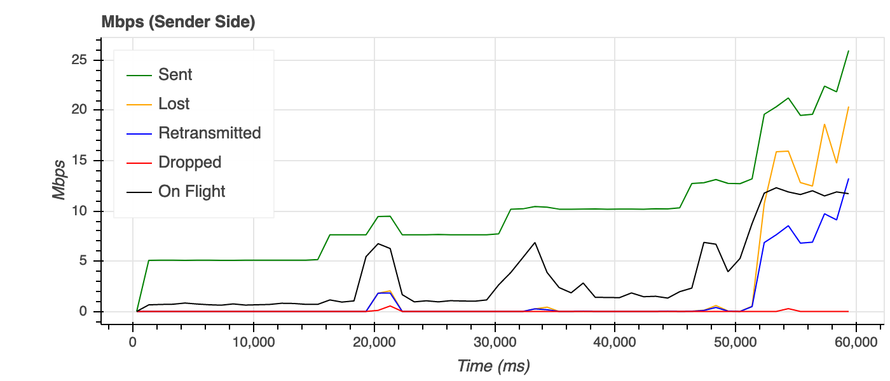
  <figcaption>Fig.5. Throughput test (sender side).</figcaption>
</figure>

<figure>
  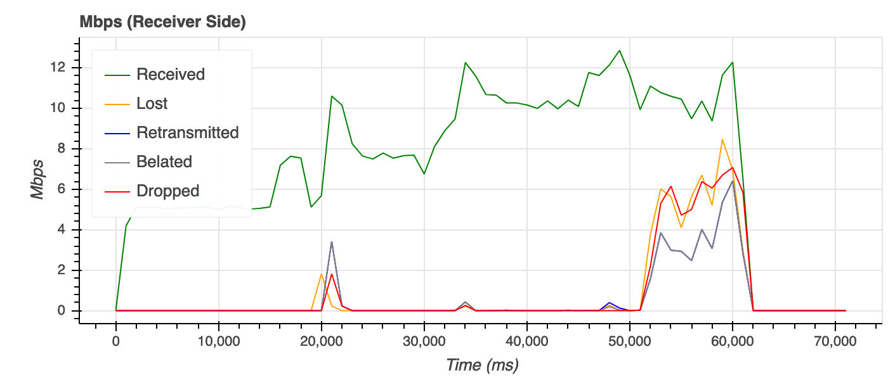
  <figcaption>Fig.6. Throughput test (receiver side).</figcaption>
</figure>

<figure>
  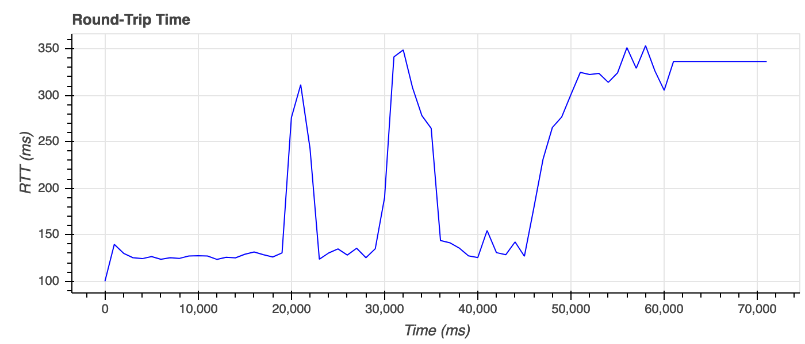
  <figcaption>Fig.7. RTT in the throughput test .</figcaption>
</figure>

The maximum bandwidth limit (output rate limit) of SRT can be specified directly using the [SRTO_MAXBW](https://github.com/Haivision/srt/blob/master/docs/API/API-socket-options.md#srto_maxbw) socket option. The limit can also be set in a different way by specifying the input (source) bitrate (see [SRTO_INPUTBW](https://github.com/Haivision/srt/blob/master/docs/API/API-socket-options.md#SRTO_INPUTBW)) and allowed overhead (see [SRTO_OHEADBW](https://github.com/Haivision/srt/blob/master/docs/API/API-socket-options.md#srto_oheadbw)) on top of it (`MAXBW = INPUTBW x (1 + OHEADBW)`). In such a configuration an input bitrate can be either set or estimated by SRT in runtime. Due to larger variations in RTT and congestion conditions in mobile networks, the higher the available overhead is, the better. This is because an opportunity to briefly send at a higher speed makes it possible for SRT to retransmit more packets and try to recover packet loss faster once the congestion and RTT are reduced.

It can be thus concluded that it is safer to stream at 8 Mbps over this network, allowing retransmissions at up to 10 Mbps (25% on top of 8 Mbps). Allowing higher retransmission rates may cause a self-congestion, dramatically reducing the percentage of packets reaching the decoder (receiving application).

## 3. SRT Streaming Results

#### 3.1. Streaming at 8 Mbps and 750 ms Latency (v1.5.0 RC0)

According to the selected configuration, we sent a test stream at 8 Mbps with the maximum bandwidth limit set to 10 Mbps (1250000 Bytes/s), and the receiver buffering latency set to 750 ms. The results of such streaming are presented in Fig. 8 - 12.

```
(sender, MacBook Asia North via 4G)
./srt-xtransmit generate srt://remote_ip:4200?maxbw=1250000 --sendrate 5Mbps --duration 180s --enable-metrics --statsfile stats-snd.csv --statsfreq 100ms -v
```

Overall, it can be seen that there is a small amount of packet loss on the link, and it is efficiently recovered by retransmissions of the lost packets (see blue and red lines on Fig. 8-9 for retransmitted and dropped packets). This kind of loss has been already shown with pure UDP streaming (see Fig. 1).

There is, however, a notable loss of packets on the link around the 20th second (see Fig. 8-9). During this congestion event the path RTT had increased up to 1200 ms (see Fig. 10), exceeding the configured SRT latency. With such an increase of RTT, packets reach the receiver later than the target configured latency. Therefore, SRT has an empty receiver buffer and no time to recover the packet loss by a retransmission. Afterwards, the lost packets are arriving at 12 Mbps even though the sender has never exceeded 9 Mbps. This means those packets were buffered in the network and delivered in a burst once the resources were given back to the user by the mobile service. To be able to recover such a high loss, SRT latency should be increased above the spike of the RTT. Alternatively, this type of congestion can be considered rare and the resulting visual artefacts after the loss may be acceptable in favour of the lower end-to-end latency.


<figure>
  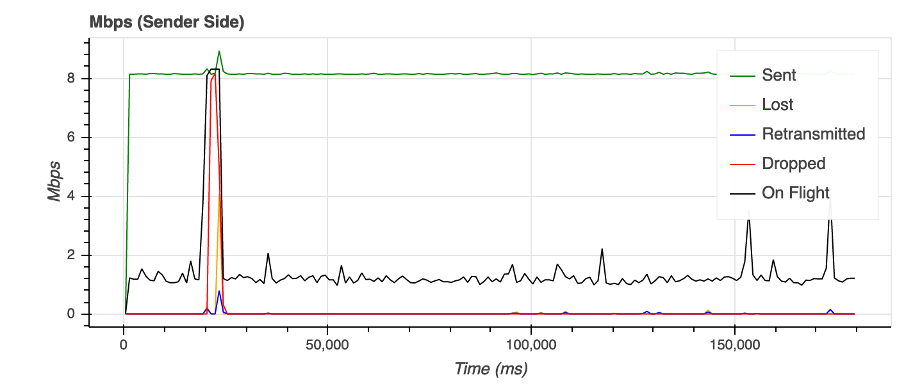
  <figcaption>Fig.8. Sender side statistics of the 8 Mbps stream with 750 ms latency .</figcaption>
</figure>

<figure>
  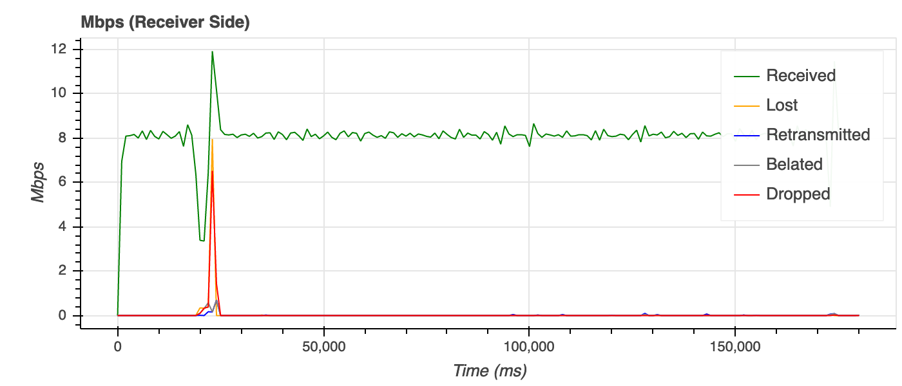
  <figcaption>Fig.9. Receiver side statistics of the 8 Mbps stream with 750 ms latency .</figcaption>
</figure>

<figure>
  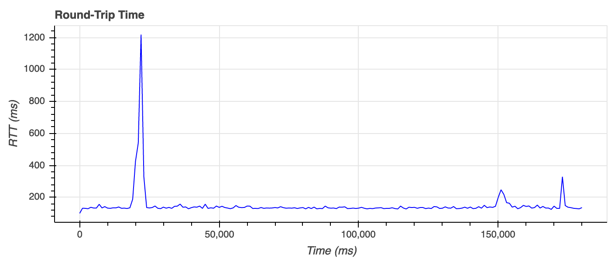
  <figcaption>Fig.10. RTT on the path of the 8 Mbps stream with 750 ms latency .</figcaption>
</figure>

<figure>
  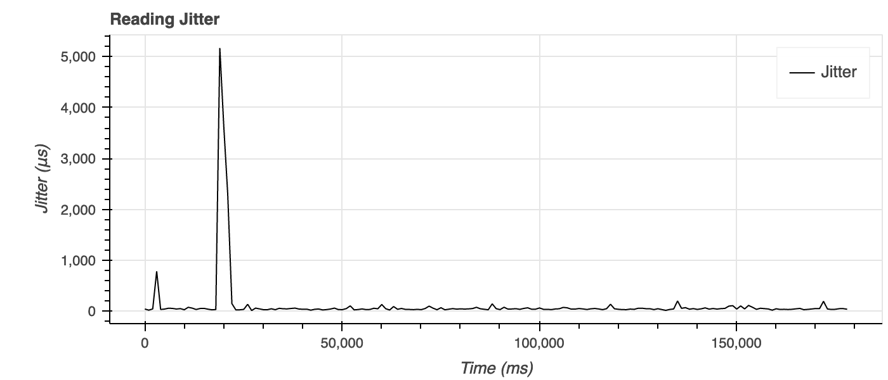
  <figcaption>Fig.11. Jitter of reading the 8 Mbps stream with 750 ms latency from SRT.</figcaption>
</figure>

<figure>
  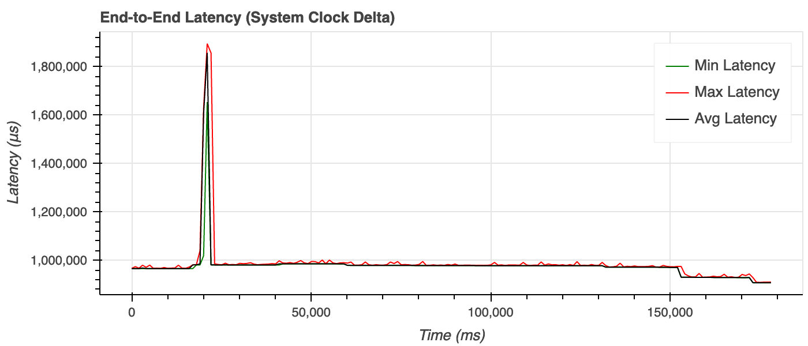
  <figcaption>Fig.12. End-to-end latency of reading the 8 Mbps stream with 750 ms latency from SRT.</figcaption>
</figure>

Note also that right after the heavy loss there is a spike in the end-to-end latency and jitter (after SRT) on the receiver side (see Fig. 11-12). The increase in latency happens because packets arrive in order, although delayed beyond the buffering latency. SRT does not drop these packets as they can be delivered to the receiving application (e.g. decoder) with origin timestamps. It is the decoder's job in this case to decide (e.g. based on those timestamps) what to do with delayed packets. For example, a video decoder could still decode related video frames (that might be reference frames) but either not present them to the user, or temporally increase the frame rate to catch up with the latency.

The jitter (Fig. 11) fluctuates around 50 microseconds, which is notably lower compared to that of around 4 ms for pure UDP (Fig. 3). There are, however, notable small spikes related to an increase of the path RTT. Because the RTT increases from 150 ms to 1200 ms (beyond the configured SRT latency), the end-to-end latency temporally increases by roughly 820 ms.

#### 3.3. Streaming at 8 Mbps and 1200 ms Latency (v1.5.0 RC0)

Let us try to compensate the observed notable increase of RTT by increasing the SRT buffering latency to 1200 ms. The results of streaming at 8 Mbps with the maximum bandwidth limit set to 10 Mbits and the receiver buffering latency of 1200 ms are presented on Fig.13- 17.

From the sender side statistics, it can be seen that as before SRT compensates for a small percentage of packet loss. There is no packet drop for the receiving decoder (no packet loss after SRT). Note that the SRT sender does drop packets once it decides that it no longer makes sense to retransmit them (see Fig. 13), and therefore no need to keep them in its buffer. However, the receiver does not drop packets, because all of the retransmissions manage to recover packet loss in time (Fig. 14).

Note also that the lost packets statistics of the sender count all events of loss reports for a packet, including repeated ones. The receiver-side statistics only count the actual loss detection event, not the number of loss reports sent. Therefore, these statistics do not match in Fig. 13 and 14.

<figure>
  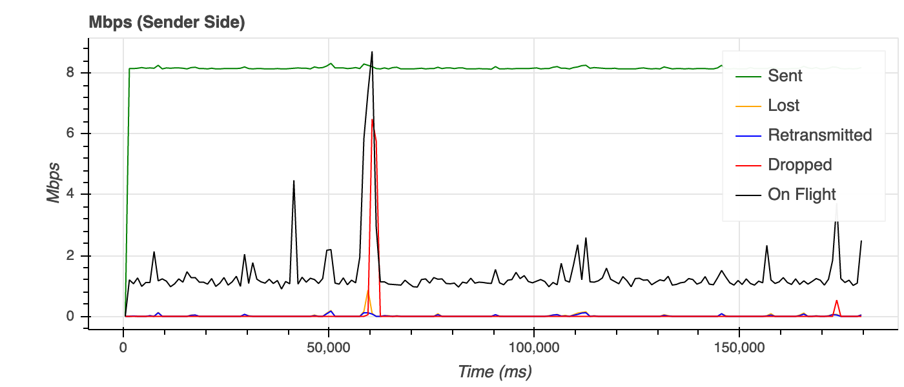
  <figcaption>Fig.13. Sender side statistics of the 8 Mbps SRT stream with 1200 ms latency.</figcaption>
</figure>

<figure>
  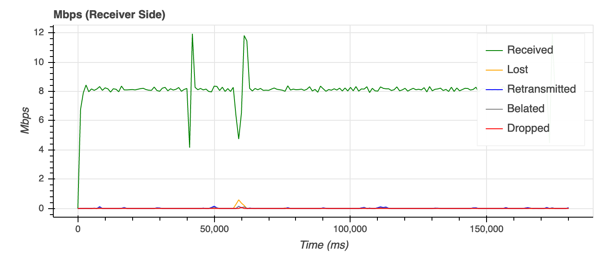
  <figcaption>Fig.14. Receiver side statistics of the 8 Mbps SRT stream with 1200 ms latency.</figcaption>
</figure>

There was a notable increase of the RTT at the 60th second of streaming (see Fig. 15), and a packet loss observed by the receiver. However, SRT managed to recover the packet loss and compensate for the increase in RTT.

<figure>
  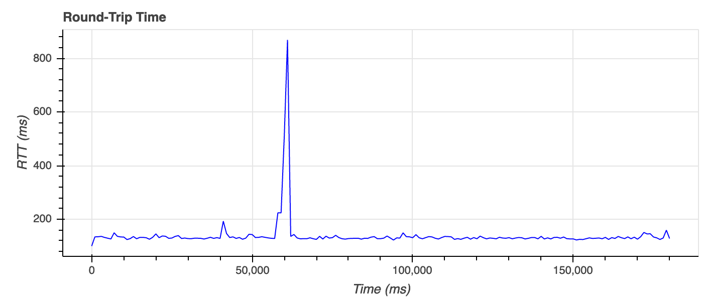
  <figcaption>Fig.15. Path RTT during the 8 Mbps SRT stream with 1200 ms latency.</figcaption>
</figure>

<figure>
  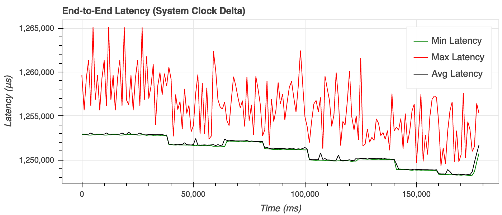
  <figcaption>Fig.16. End-to-end latency during the 8 Mbps SRT stream with 1200 ms latency.</figcaption>
</figure>

<figure>
  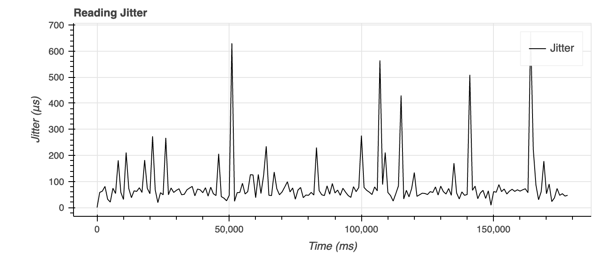
  <figcaption>Fig.17. Jitter during the 8 Mbps SRT stream with 1200 ms latency.</figcaption>
</figure>

## Conclusion

The results of the experiments described here show how a live stream over SRT on a mobile network can be configured. At the cost of a slightly increased end-to-end latency (5 x RTT or higher) a stream will tolerate persistent minor packet loss in the network and possible packet reordering, and will exhibit low jitter on the output.

Results were obtained using a stationary 4G hotspot. In the case of a non-stationary mobile hotspot network characteristics would differ, and the SRT configuration might need to be altered towards a higher latency to cope with packet loss and increased delays during switching between mobile stations (towers). This subject may be explored in a future article.
